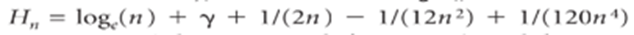

# Basic Java Programming

- [Syllabus](./Basic%20Java%20Programming%20-Syllabus%202023%20-%20Nacc%20Format.pdf)
  
## Practicals

**Please select the link with respect to your course and section**

### I BSc CS A 

| Topic                                                                                                                                                                                                                                                                                                                                                                                                                                                                                                                                                                                                                                                                                                                                                                             | Release Date | Deadline  | Practical Link | Algorithm Link |
|-----------------------------------------------------------------------------------------------------------------------------------------------------------------------------------------------------------------------------------------------------------------------------------------------------------------------------------------------------------------------------------------------------------------------------------------------------------------------------------------------------------------------------------------------------------------------------------------------------------------------------------------------------------------------------------------------------------------------------------------------------------------------------------|--------------|-----------|----------------|----------------|
| 1. Write a java program that prints the Hello, World message 10 times.                                                                                                                                                                                                                                                                                                                                                                                                                                                                                                                                                                                                                                                                                                            | 15-Jul-23    | 15-Jul-23 | [Practical 1](https://classroom.github.com/a/Cjyvh8CK)    | [Algorithm 1](./practical-algorithms/algorithm-1.md)    |
| 2. Write a java program named as UseThree.java that takes three names as command-line arguments and prints a proper sentence with the names in the reverse of the order given, so that, for example, java UseThreeAlice Bob Carol prints Hi Carol, Bob, and Alice.                                                                                                                                                                                                                                                                                                                                                                                                                                                                                                                |              |           | [Practical 2](https://classroom.github.com/a/bycDNRz7)    | [Algorithm 2](./practical-algorithms/algorithm-2.md)    |
| 3. Write a program that uses Math.sin() and Math.cos() to check that the value of cos2θ + sin2θ is approximately 1 for any θ entered as a command-line argument.                                                                                                                                                                                                                                                                                                                                                                                                                                                                                                                                                                                                                  |              |           | [Practical 3](https://classroom.github.com/a/hxESQxET)    | [Algorithm 3](./practical-algorithms/algorithm-3.md)    |
| 4. Write a program that takes three double command-line arguments x,y, and z and prints true if the values are strictly ascending or descending (x < y < z or x > y > z), and false otherwise.                                                                                                                                                                                                                                                                                                                                                                                                                                                                                                                                                                                    |              |         | [Practical 4](https://classroom.github.com/a/EyMiCgtg)    | [Algorithm 4](./practical-algorithms/algorithm-4.md)    |
| 5. Wind chill. Given the temperature T (in degrees Fahrenheit) and the wind speed v (in miles per hour), the National Weather Service defines the effective temperature (the wind chill) as follows: w = 35.74 +0.6215 T+ (0.4275* T-¬ 35.75) *v 0.16. Write a program that takes two double command-line arguments temperature and velocity and prints the wind chill. Use Math.pow(a, b) to compute ab. Note: The formula is not valid if T is larger than 50 in absolute value or if v is larger than 120 or less than 3 (you may assume that the values you get are in that range).                                                                                                                                                                                           |              |           | [Practical 5](https://classroom.github.com/a/wcXpdE0J)    | [Algorithm 5](./practical-algorithms/algorithm-5.md)    |
| 6. Write a program that prints five uniform random numbers between 0 and 1, their average value, and their minimum and maximum values. Use Math.random(), Math.min(), and Math.max().                                                                                                                                                                                                                                                                                                                                                                                                                                                                                                                                                                                             |              |           | [Practical 6](https://classroom.github.com/a/antGNMF2)    | [Algorithm 6](./practical-algorithms/algorithm-6.md)    |
| 7. Continuously compounded interest. Write a program that calculates and prints the amount of money you would have after t years if you invested P dollars at an annual interest rate r (compounded continuously). The desired value is given by the formula Pert                                                                                                                                                                                                                                                                                                                                                                                                                                                                                                                 |              |           | [Practical 7](https://classroom.github.com/a/GsSYDex1)    | [Algorithm 7](./practical-algorithms/algorithm-7.md)    |
| 8. Write a program that takes three integer command-line arguments and prints equal if all three are equal, and not equal otherwise.                                                                                                                                                                                                                                                                                                                                                                                                                                                                                                                                                                                                                                              |              |           | [Practical 8](https://classroom.github.com/a/V9Vxb93M)    | [Algorithm 8](./practical-algorithms/algorithm-8.md)    |
| 9. Write a program PrimeCounter that takes an integer command-line argument n and finds the number of primes less than or equal to n.                                                                                                                                                                                                                                                                                                                                                                                                                                                                                                                                                                                                                                             |              |           | [Practical 9](https://classroom.github.com/a/fk3eE1mr)    | [Algorithm 9](./practical-algorithms/algorithm-9.md)    |
| 10. Write a program that, using one for loop and one if statement, prints the integers from 1,000 to 2,000 with five integers per line. Hint: Use the % operation.                                                                                                                                                                                                                                                                                                                                                                                                                                                                                                                                                                                                                |              |           | [Practical 10](https://classroom.github.com/a/X5AUyC_2)   | [Algorithm 10](./practical-algorithms/algorithm-10.md)   |
| 11. Ramanujan’s taxi. SrinivasaRamanujan was an Indian mathematician who became famous for his intuition for numbers. When the English mathematician G. H. Hardy came to visit him one day, Hardy remarked that the number of his taxi was 1729, a rather dull number. To which Ramanujan replied, “No, Hardy! No, Hardy! It is a very interesting number. It is the smallest number expressible as the sum of two cubes in two different ways.” Verify this claim by writing a program that takes an integer command-line argument n and prints all integers less than or equal to n that can be expressed as the sum of two cubes in two different ways. In other words, find distinct positive integers a, b, c, and d such that a3 + b3 = c3 + d3. Use four nested for loops. |              |           | [Practical 11](https://classroom.github.com/a/xG8Fbc1N)   | [Algorithm 11](./practical-algorithms/algorithm-11.md)   |
| 12. Write a program that takes an integer command-line argument n and prints all the positive powers of 2 less than or equal to n. Make sure that your program works properly for all values of n.                                                                                                                                                                                                                                                                                                                                                                                                                                                                                                                                                                                |              |           | [Practical 12](https://classroom.github.com/a/FX2chFjc)   | [Algorithm 12](./practical-algorithms/algorithm-12.md)   |
| 13. Write a code fragment that reverses the order of the values in a one dimensional string array. Do not create another array to hold the result?                                                                                                                                                                                                                                                                                                                                                                                                                                                                                                                                                                                                                                |              |           | [Practical 13](https://classroom.github.com/a/JlobUQwS)   | [Algorithm 13](./practical-algorithms/algorithm-13.md)   |
| 14. Write a program that reads in integers (as many as the user enters) from standard input and prints the maximum and minimum values.                                                                                                                                                                                                                                                                                                                                                                                                                                                                                                                                                                                                                                            |              |           | [Practical 14](https://classroom.github.com/a/EyGmg2HT)   | [Algorithm 14](./practical-algorithms/algorithm-14.md)   |
| 15. Write a program that takes an integer command-line argument n, reads n floating-point numbers from standard input, and prints their mean (average value) and sample standard deviation (square root of the sum of the squares of their differences from the average, divided by n-1).                                                                                                                                                                                                                                                                                                                                                                                                                                                                                         |              |           | [Practical 15](https://classroom.github.com/a/0-StEbF1)   | [Algorithm 15](./practical-algorithms/algorithm-15.md)   |
| 16. Write a program that reads in text from standard input and prints the number of words in the text.                                                                                                                                                                                                                                                                                                                                                                                                                                                                                                                                                                                                                                                                            |              |           | [Practical 16](https://classroom.github.com/a/OHSNpmJO)   | [Algorithm 16](./practical-algorithms/algorithm-16.md)   |
| 17. Write a static method max3() that takes three int arguments and returns the value of the largest one. Add an overloaded function that does the same thing with three double values.                                                                                                                                                                                                                                                                                                                                                                                                                                                                                                                                                                                           |              |           | [Practical 17](https://classroom.github.com/a/D8z_dfOu)   | [Algorithm 17](./practical-algorithms/algorithm-17.md)   |
| 18. Write a static method majority() that takes three boolean arguments and returns true if at least two of the argument values are true, and false otherwise. Do not use an if statement.                                                                                                                                                                                                                                                                                                                                                                                                                                                                                                                                                                                        |              |           | [Practical 18](https://classroom.github.com/a/PnE5NB0_)   | [Algorithm 18](./practical-algorithms/algorithm-18.md)   |
| 19. Write a static method reverse() that takes an array of strings as its argument and returns a new array with the strings in reverse order.                                                                                                                                                                                                                                                                                                                                                                                                                                                                                                                                                                                                                                     |              |           | Practical 19   | [Algorithm 19](./practical-algorithms/algorithm-19.md)   |
| 20. Write a program Harmonic that contains three staticmethods harmoinc(), harmoincSmall(), and harmonicLarge() for computing the harmonic numbers. The harmonicSmall() method should just computethe sum (Hn = 1 + 1/2 + 1/3 + … + 1/n), the harmonicLarge() method should use the approximation  (the number = 0.577215664901532… is known as Euler’s constant), and the harmonic() method should call harmonicSmall() for n < 100 and harmonicLarge() otherwise.                                                                                                                                                                                                                                                                                                               |              |           | Practical 20   | [Algorithm 20](./practical-algorithms/algorithm-20.md)   |

### I BSc CS B 

| Topic                                                                                                                                                                                                                                                                                                                                                                                                                                                                                                                                                                                                                                                                                                                                                                             | Release Date | Deadline  | Practical Link | Algorithm Link |
|-----------------------------------------------------------------------------------------------------------------------------------------------------------------------------------------------------------------------------------------------------------------------------------------------------------------------------------------------------------------------------------------------------------------------------------------------------------------------------------------------------------------------------------------------------------------------------------------------------------------------------------------------------------------------------------------------------------------------------------------------------------------------------------|--------------|-----------|----------------|----------------|
| 1. Write a java program that prints the Hello, World message 10 times.                                                                                                                                                                                                                                                                                                                                                                                                                                                                                                                                                                                                                                                                                                            | 15-Jul-23    | 15-Jul-23 | [Practical 1](https://classroom.github.com/a/v1iLCnl-)    | [Algorithm 1](./practical-algorithms/algorithm-1.md)    |
| 2. Write a java program named as UseThree.java that takes three names as command-line arguments and prints a proper sentence with the names in the reverse of the order given, so that, for example, java UseThreeAlice Bob Carol prints Hi Carol, Bob, and Alice.                                                                                                                                                                                                                                                                                                                                                                                                                                                                                                                |              |           | [Practical 2](https://classroom.github.com/a/bOGXp7j5)    | [Algorithm 2](./practical-algorithms/algorithm-2.md)    |
| 3. Write a program that uses Math.sin() and Math.cos() to check that the value of cos2θ + sin2θ is approximately 1 for any θ entered as a command-line argument.                                                                                                                                                                                                                                                                                                                                                                                                                                                                                                                                                                                                                  |              |           | [Practical 3](https://classroom.github.com/a/1ll5mabM)    | [Algorithm 3](./practical-algorithms/algorithm-3.md)    |
| 4. Write a program that takes three double command-line arguments x,y, and z and prints true if the values are strictly ascending or descending (x < y < z or x > y > z), and false otherwise.                                                                                                                                                                                                                                                                                                                                                                                                                                                                                                                                                                                    |              |           | [Practical 4](https://classroom.github.com/a/Yf37GddY)    | [Algorithm 4](./practical-algorithms/algorithm-4.md)    |
| 5. Wind chill. Given the temperature T (in degrees Fahrenheit) and the wind speed v (in miles per hour), the National Weather Service defines the effective temperature (the wind chill) as follows: w = 35.74 +0.6215 T+ (0.4275* T-¬ 35.75) *v 0.16. Write a program that takes two double command-line arguments temperature and velocity and prints the wind chill. Use Math.pow(a, b) to compute ab. Note: The formula is not valid if T is larger than 50 in absolute value or if v is larger than 120 or less than 3 (you may assume that the values you get are in that range).                                                                                                                                                                                           |              |           | [Practical 5](https://classroom.github.com/a/q8Tmh068)    | [Algorithm 5](./practical-algorithms/algorithm-5.md)    |
| 6. Write a program that prints five uniform random numbers between 0 and 1, their average value, and their minimum and maximum values. Use Math.random(), Math.min(), and Math.max().                                                                                                                                                                                                                                                                                                                                                                                                                                                                                                                                                                                             |              |           | [Practical 6](https://classroom.github.com/a/1fUMlkso)    | [Algorithm 6](./practical-algorithms/algorithm-6.md)    |
| 7. Continuously compounded interest. Write a program that calculates and prints the amount of money you would have after t years if you invested P dollars at an annual interest rate r (compounded continuously). The desired value is given by the formula Pert                                                                                                                                                                                                                                                                                                                                                                                                                                                                                                                 |              |           | [Practical 7](https://classroom.github.com/a/1_1oK2ji)    | [Algorithm 7](./practical-algorithms/algorithm-7.md)    |
| 8. Write a program that takes three integer command-line arguments and prints equal if all three are equal, and not equal otherwise.                                                                                                                                                                                                                                                                                                                                                                                                                                                                                                                                                                                                                                              |              |           | [Practical 8](https://classroom.github.com/a/uf3RbpjO)    | [Algorithm 8](./practical-algorithms/algorithm-8.md)    |
| 9. Write a program PrimeCounter that takes an integer command-line argument n and finds the number of primes less than or equal to n.                                                                                                                                                                                                                                                                                                                                                                                                                                                                                                                                                                                                                                             |              |           | [Practical 9](https://classroom.github.com/a/IM_8ROuS)    | [Algorithm 9](./practical-algorithms/algorithm-9.md)    |
| 10. Write a program that, using one for loop and one if statement, prints the integers from 1,000 to 2,000 with five integers per line. Hint: Use the % operation.                                                                                                                                                                                                                                                                                                                                                                                                                                                                                                                                                                                                                |              |           | [Practical 10](https://classroom.github.com/a/vNUNUWFj)   | [Algorithm 10](./practical-algorithms/algorithm-10.md)   |
| 11. Ramanujan’s taxi. SrinivasaRamanujan was an Indian mathematician who became famous for his intuition for numbers. When the English mathematician G. H. Hardy came to visit him one day, Hardy remarked that the number of his taxi was 1729, a rather dull number. To which Ramanujan replied, “No, Hardy! No, Hardy! It is a very interesting number. It is the smallest number expressible as the sum of two cubes in two different ways.” Verify this claim by writing a program that takes an integer command-line argument n and prints all integers less than or equal to n that can be expressed as the sum of two cubes in two different ways. In other words, find distinct positive integers a, b, c, and d such that a3 + b3 = c3 + d3. Use four nested for loops. |              |           | [Practical 11](https://classroom.github.com/a/oktlh4VS)   | [Algorithm 11](./practical-algorithms/algorithm-11.md)   |
| 12. Write a program that takes an integer command-line argument n and prints all the positive powers of 2 less than or equal to n. Make sure that your program works properly for all values of n.                                                                                                                                                                                                                                                                                                                                                                                                                                                                                                                                                                                |              |           | [Practical 12](https://classroom.github.com/a/o4mRM2mf)   | [Algorithm 12](./practical-algorithms/algorithm-12.md)   |
| 13. Write a code fragment that reverses the order of the values in a one dimensional string array. Do not create another array to hold the result?                                                                                                                                                                                                                                                                                                                                                                                                                                                                                                                                                                                                                                |              |           | [Practical 13](https://classroom.github.com/a/-yUSfcv_)   | [Algorithm 13](./practical-algorithms/algorithm-13.md)   |
| 14. Write a program that reads in integers (as many as the user enters) from standard input and prints the maximum and minimum values.                                                                                                                                                                                                                                                                                                                                                                                                                                                                                                                                                                                                                                            |              |           | [Practical 14](https://classroom.github.com/a/AIu5m9hl)   | [Algorithm 14](./practical-algorithms/algorithm-14.md)   |
| 15. Write a program that takes an integer command-line argument n, reads n floating-point numbers from standard input, and prints their mean (average value) and sample standard deviation (square root of the sum of the squares of their differences from the average, divided by n-1).                                                                                                                                                                                                                                                                                                                                                                                                                                                                                         |              |           | [Practical 15](https://classroom.github.com/a/VVC0fSD1)   | [Algorithm 15](./practical-algorithms/algorithm-15.md)   |
| 16. Write a program that reads in text from standard input and prints the number of words in the text.                                                                                                                                                                                                                                                                                                                                                                                                                                                                                                                                                                                                                                                                            |              |           | [Practical 16](https://classroom.github.com/a/Sgt1FzmN)   | [Algorithm 16](./practical-algorithms/algorithm-16.md)   |
| 17. Write a static method max3() that takes three int arguments and returns the value of the largest one. Add an overloaded function that does the same thing with three double values.                                                                                                                                                                                                                                                                                                                                                                                                                                                                                                                                                                                           |              |           | [Practical 17](https://classroom.github.com/a/7SpIp8wu)   | [Algorithm 17](./practical-algorithms/algorithm-17.md)   |
| 18. Write a static method majority() that takes three boolean arguments and returns true if at least two of the argument values are true, and false otherwise. Do not use an if statement.                                                                                                                                                                                                                                                                                                                                                                                                                                                                                                                                                                                        |              |           | [Practical 18](https://classroom.github.com/a/b3TDSbM4)   | [Algorithm 18](./practical-algorithms/algorithm-18.md)   |
| 19. Write a static method reverse() that takes an array of strings as its argument and returns a new array with the strings in reverse order.                                                                                                                                                                                                                                                                                                                                                                                                                                                                                                                                                                                                                                     |              |           | Practical 19   | [Algorithm 19](./practical-algorithms/algorithm-19.md)   |
| 20. Write a program Harmonic that contains three staticmethods harmoinc(), harmoincSmall(), and harmonicLarge() for computing the harmonic numbers. The harmonicSmall() method should just computethe sum (Hn = 1 + 1/2 + 1/3 + … + 1/n), the harmonicLarge() method should use the approximation  (the number = 0.577215664901532… is known as Euler’s constant), and the harmonic() method should call harmonicSmall() for n < 100 and harmonicLarge() otherwise.                                                                                                                                                                                                                                                                                                               |              |           | Practical 20   | [Algorithm 20](./practical-algorithms/algorithm-20.md)   |

### I BSc IT A 

| Topic                                                                                                                                                                                                                                                                                                                                                                                                                                                                                                                                                                                                                                                                                                                                                                             | Release Date | Deadline  | Practical Link | Algorithm Link |
|-----------------------------------------------------------------------------------------------------------------------------------------------------------------------------------------------------------------------------------------------------------------------------------------------------------------------------------------------------------------------------------------------------------------------------------------------------------------------------------------------------------------------------------------------------------------------------------------------------------------------------------------------------------------------------------------------------------------------------------------------------------------------------------|--------------|-----------|----------------|----------------|
| 1. Write a java program that prints the Hello, World message 10 times.                                                                                                                                                                                                                                                                                                                                                                                                                                                                                                                                                                                                                                                                                                            | 15-Jul-23    | 15-Jul-23 | [Practical 1](https://classroom.github.com/a/Lf7GRvPc)    | [Algorithm 1](./practical-algorithms/algorithm-1.md)    |
| 2. Write a java program named as UseThree.java that takes three names as command-line arguments and prints a proper sentence with the names in the reverse of the order given, so that, for example, java UseThreeAlice Bob Carol prints Hi Carol, Bob, and Alice.                                                                                                                                                                                                                                                                                                                                                                                                                                                                                                                |              |           | [Practical 2](https://classroom.github.com/a/zCK4mUtn)    | [Algorithm 2](./practical-algorithms/algorithm-2.md)    |
| 3. Write a program that uses Math.sin() and Math.cos() to check that the value of cos2θ + sin2θ is approximately 1 for any θ entered as a command-line argument.                                                                                                                                                                                                                                                                                                                                                                                                                                                                                                                                                                                                                  |              |           | [Practical 3](https://classroom.github.com/a/unAuTyt3)    | [Algorithm 3](./practical-algorithms/algorithm-3.md)    |
| 4. Write a program that takes three double command-line arguments x,y, and z and prints true if the values are strictly ascending or descending (x < y < z or x > y > z), and false otherwise.                                                                                                                                                                                                                                                                                                                                                                                                                                                                                                                                                                                    |              |           | [Practical 4](https://classroom.github.com/a/kqhT1k5X)    | [Algorithm 4](./practical-algorithms/algorithm-4.md)    |
| 5. Wind chill. Given the temperature T (in degrees Fahrenheit) and the wind speed v (in miles per hour), the National Weather Service defines the effective temperature (the wind chill) as follows: w = 35.74 +0.6215 T+ (0.4275* T-¬ 35.75) *v 0.16. Write a program that takes two double command-line arguments temperature and velocity and prints the wind chill. Use Math.pow(a, b) to compute ab. Note: The formula is not valid if T is larger than 50 in absolute value or if v is larger than 120 or less than 3 (you may assume that the values you get are in that range).                                                                                                                                                                                           |              |           | [Practical 5](https://classroom.github.com/a/d7Sd4nqs)    | [Algorithm 5](./practical-algorithms/algorithm-5.md)    |
| 6. Write a program that prints five uniform random numbers between 0 and 1, their average value, and their minimum and maximum values. Use Math.random(), Math.min(), and Math.max().                                                                                                                                                                                                                                                                                                                                                                                                                                                                                                                                                                                             |              |           | [Practical 6](https://classroom.github.com/a/ehc0Iaq6)    | [Algorithm 6](./practical-algorithms/algorithm-6.md)    |
| 7. Continuously compounded interest. Write a program that calculates and prints the amount of money you would have after t years if you invested P dollars at an annual interest rate r (compounded continuously). The desired value is given by the formula Pert                                                                                                                                                                                                                                                                                                                                                                                                                                                                                                                 |              |           | [Practical 7](https://classroom.github.com/a/OASL9Wuw)    | [Algorithm 7](./practical-algorithms/algorithm-7.md)    |
| 8. Write a program that takes three integer command-line arguments and prints equal if all three are equal, and not equal otherwise.                                                                                                                                                                                                                                                                                                                                                                                                                                                                                                                                                                                                                                              |              |           | [Practical 8](https://classroom.github.com/a/hCpy67Hc)    | [Algorithm 8](./practical-algorithms/algorithm-8.md)    |
| 9. Write a program PrimeCounter that takes an integer command-line argument n and finds the number of primes less than or equal to n.                                                                                                                                                                                                                                                                                                                                                                                                                                                                                                                                                                                                                                             |              |           | [Practical 9](https://classroom.github.com/a/fam5BcVu)    | [Algorithm 9](./practical-algorithms/algorithm-9.md)    |
| 10. Write a program that, using one for loop and one if statement, prints the integers from 1,000 to 2,000 with five integers per line. Hint: Use the % operation.                                                                                                                                                                                                                                                                                                                                                                                                                                                                                                                                                                                                                |              |           | [Practical 10](https://classroom.github.com/a/ei9c_YiH)   | [Algorithm 10](./practical-algorithms/algorithm-10.md)   |
| 11. Ramanujan’s taxi. SrinivasaRamanujan was an Indian mathematician who became famous for his intuition for numbers. When the English mathematician G. H. Hardy came to visit him one day, Hardy remarked that the number of his taxi was 1729, a rather dull number. To which Ramanujan replied, “No, Hardy! No, Hardy! It is a very interesting number. It is the smallest number expressible as the sum of two cubes in two different ways.” Verify this claim by writing a program that takes an integer command-line argument n and prints all integers less than or equal to n that can be expressed as the sum of two cubes in two different ways. In other words, find distinct positive integers a, b, c, and d such that a3 + b3 = c3 + d3. Use four nested for loops. |              |           | [Practical 11](https://classroom.github.com/a/QDx_2-JK)   | [Algorithm 11](./practical-algorithms/algorithm-11.md)   |
| 12. Write a program that takes an integer command-line argument n and prints all the positive powers of 2 less than or equal to n. Make sure that your program works properly for all values of n.                                                                                                                                                                                                                                                                                                                                                                                                                                                                                                                                                                                |              |           | [Practical 12](https://classroom.github.com/a/cFmCbtI_)   | [Algorithm 12](./practical-algorithms/algorithm-12.md)   |
| 13. Write a code fragment that reverses the order of the values in a one dimensional string array. Do not create another array to hold the result?                                                                                                                                                                                                                                                                                                                                                                                                                                                                                                                                                                                                                                |              |           | [Practical 13](https://classroom.github.com/a/fbfooJlt)   | [Algorithm 13](./practical-algorithms/algorithm-13.md)   |
| 14. Write a program that reads in integers (as many as the user enters) from standard input and prints the maximum and minimum values.                                                                                                                                                                                                                                                                                                                                                                                                                                                                                                                                                                                                                                            |              |           | [Practical 14](https://classroom.github.com/a/-JGAAatC)   | [Algorithm 14](./practical-algorithms/algorithm-14.md)   |
| 15. Write a program that takes an integer command-line argument n, reads n floating-point numbers from standard input, and prints their mean (average value) and sample standard deviation (square root of the sum of the squares of their differences from the average, divided by n-1).                                                                                                                                                                                                                                                                                                                                                                                                                                                                                         |              |           | [Practical 15](https://classroom.github.com/a/YDntEwu4)   | [Algorithm 15](./practical-algorithms/algorithm-15.md)   |
| 16. Write a program that reads in text from standard input and prints the number of words in the text.                                                                                                                                                                                                                                                                                                                                                                                                                                                                                                                                                                                                                                                                            |              |           | [Practical 16](https://classroom.github.com/a/gIwe1l3Q)   | [Algorithm 16](./practical-algorithms/algorithm-16.md)   |
| 17. Write a static method max3() that takes three int arguments and returns the value of the largest one. Add an overloaded function that does the same thing with three double values.                                                                                                                                                                                                                                                                                                                                                                                                                                                                                                                                                                                           |              |           | [Practical 17](https://classroom.github.com/a/5ELUH9RT)   | [Algorithm 17](./practical-algorithms/algorithm-17.md)   |
| 18. Write a static method majority() that takes three boolean arguments and returns true if at least two of the argument values are true, and false otherwise. Do not use an if statement.                                                                                                                                                                                                                                                                                                                                                                                                                                                                                                                                                                                        |              |           | [Practical 18](https://classroom.github.com/a/7HxThgrt)   | [Algorithm 18](./practical-algorithms/algorithm-18.md)   |
| 19. Write a static method reverse() that takes an array of strings as its argument and returns a new array with the strings in reverse order.                                                                                                                                                                                                                                                                                                                                                                                                                                                                                                                                                                                                                                     |              |           | [Practical 19](https://classroom.github.com/a/FgU09wLT)   | [Algorithm 19](./practical-algorithms/algorithm-19.md)   |
| 20. Write a program Harmonic that contains three staticmethods harmoinc(), harmoincSmall(), and harmonicLarge() for computing the harmonic numbers. The harmonicSmall() method should just computethe sum (Hn = 1 + 1/2 + 1/3 + … + 1/n), the harmonicLarge() method should use the approximation  (the number = 0.577215664901532… is known as Euler’s constant), and the harmonic() method should call harmonicSmall() for n < 100 and harmonicLarge() otherwise.                                                                                                                                                                                                                                                                                                               |              |           | [Practical 20](https://classroom.github.com/a/hYaQNdSx)   | [Algorithm 20](./practical-algorithms/algorithm-20.md)   |

### I BSc IT B 

| Topic                                                                                                                                                                                                                                                                                                                                                                                                                                                                                                                                                                                                                                                                                                                                                                             | Release Date | Deadline  | Practical Link | Algorithm Link |
|-----------------------------------------------------------------------------------------------------------------------------------------------------------------------------------------------------------------------------------------------------------------------------------------------------------------------------------------------------------------------------------------------------------------------------------------------------------------------------------------------------------------------------------------------------------------------------------------------------------------------------------------------------------------------------------------------------------------------------------------------------------------------------------|--------------|-----------|----------------|----------------|
| 1. Write a java program that prints the Hello, World message 10 times.                                                                                                                                                                                                                                                                                                                                                                                                                                                                                                                                                                                                                                                                                                            | 15-Jul-23    | 15-Jul-23 | [Practical 1](https://classroom.github.com/a/i_QPjrK8)    | [Algorithm 1](./practical-algorithms/algorithm-1.md)    |
| 2. Write a java program named as UseThree.java that takes three names as command-line arguments and prints a proper sentence with the names in the reverse of the order given, so that, for example, java UseThreeAlice Bob Carol prints Hi Carol, Bob, and Alice.                                                                                                                                                                                                                                                                                                                                                                                                                                                                                                                |              |           | [Practical 2](https://classroom.github.com/a/nqiuoS-3)    | [Algorithm 2](./practical-algorithms/algorithm-2.md)    |
| 3. Write a program that uses Math.sin() and Math.cos() to check that the value of cos2θ + sin2θ is approximately 1 for any θ entered as a command-line argument.                                                                                                                                                                                                                                                                                                                                                                                                                                                                                                                                                                                                                  |              |           | [Practical 3](https://classroom.github.com/a/ZYFgXS6Y)    | [Algorithm 3](./practical-algorithms/algorithm-3.md)    |
| 4. Write a program that takes three double command-line arguments x,y, and z and prints true if the values are strictly ascending or descending (x < y < z or x > y > z), and false otherwise.                                                                                                                                                                                                                                                                                                                                                                                                                                                                                                                                                                                    |              |           | [Practical 4](https://classroom.github.com/a/jyM7X9kq)    | [Algorithm 4](./practical-algorithms/algorithm-4.md)    |
| 5. Wind chill. Given the temperature T (in degrees Fahrenheit) and the wind speed v (in miles per hour), the National Weather Service defines the effective temperature (the wind chill) as follows: w = 35.74 +0.6215 T+ (0.4275* T-¬ 35.75) *v 0.16. Write a program that takes two double command-line arguments temperature and velocity and prints the wind chill. Use Math.pow(a, b) to compute ab. Note: The formula is not valid if T is larger than 50 in absolute value or if v is larger than 120 or less than 3 (you may assume that the values you get are in that range).                                                                                                                                                                                           |              |           | [Practical 5](https://classroom.github.com/a/l0VpgK0Z)    | [Algorithm 5](./practical-algorithms/algorithm-5.md)    |
| 6. Write a program that prints five uniform random numbers between 0 and 1, their average value, and their minimum and maximum values. Use Math.random(), Math.min(), and Math.max().                                                                                                                                                                                                                                                                                                                                                                                                                                                                                                                                                                                             |              |           | [Practical 6](https://classroom.github.com/a/X6xsS02n)    | [Algorithm 6](./practical-algorithms/algorithm-6.md)    |
| 7. Continuously compounded interest. Write a program that calculates and prints the amount of money you would have after t years if you invested P dollars at an annual interest rate r (compounded continuously). The desired value is given by the formula Pert                                                                                                                                                                                                                                                                                                                                                                                                                                                                                                                 |              |           | [Practical 7](https://classroom.github.com/a/RZLCs5e0)    | [Algorithm 7](./practical-algorithms/algorithm-7.md)    |
| 8. Write a program that takes three integer command-line arguments and prints equal if all three are equal, and not equal otherwise.                                                                                                                                                                                                                                                                                                                                                                                                                                                                                                                                                                                                                                              |              |           | [Practical 8](https://classroom.github.com/a/lYxBHva2)    | [Algorithm 8](./practical-algorithms/algorithm-8.md)    |
| 9. Write a program PrimeCounter that takes an integer command-line argument n and finds the number of primes less than or equal to n.                                                                                                                                                                                                                                                                                                                                                                                                                                                                                                                                                                                                                                             |              |           | [Practical 9](https://classroom.github.com/a/ASfrJD1-)    | [Algorithm 9](./practical-algorithms/algorithm-9.md)    |
| 10. Write a program that, using one for loop and one if statement, prints the integers from 1,000 to 2,000 with five integers per line. Hint: Use the % operation.                                                                                                                                                                                                                                                                                                                                                                                                                                                                                                                                                                                                                |              |           | [Practical 10](https://classroom.github.com/a/uAMY3ZBd)   | [Algorithm 10](./practical-algorithms/algorithm-10.md)   |
| 11. Ramanujan’s taxi. SrinivasaRamanujan was an Indian mathematician who became famous for his intuition for numbers. When the English mathematician G. H. Hardy came to visit him one day, Hardy remarked that the number of his taxi was 1729, a rather dull number. To which Ramanujan replied, “No, Hardy! No, Hardy! It is a very interesting number. It is the smallest number expressible as the sum of two cubes in two different ways.” Verify this claim by writing a program that takes an integer command-line argument n and prints all integers less than or equal to n that can be expressed as the sum of two cubes in two different ways. In other words, find distinct positive integers a, b, c, and d such that a3 + b3 = c3 + d3. Use four nested for loops. |              |           | [Practical 11](https://classroom.github.com/a/pIVBBnPM)   | [Algorithm 11](./practical-algorithms/algorithm-11.md)   |
| 12. Write a program that takes an integer command-line argument n and prints all the positive powers of 2 less than or equal to n. Make sure that your program works properly for all values of n.                                                                                                                                                                                                                                                                                                                                                                                                                                                                                                                                                                                |              |           | [Practical 12](https://classroom.github.com/a/1_cXLBPz)   | [Algorithm 12](./practical-algorithms/algorithm-12.md)   |
| 13. Write a code fragment that reverses the order of the values in a one dimensional string array. Do not create another array to hold the result?                                                                                                                                                                                                                                                                                                                                                                                                                                                                                                                                                                                                                                |              |           | [Practical 13](https://classroom.github.com/a/IDLdwwUu)   | [Algorithm 13](./practical-algorithms/algorithm-13.md)   |
| 14. Write a program that reads in integers (as many as the user enters) from standard input and prints the maximum and minimum values.                                                                                                                                                                                                                                                                                                                                                                                                                                                                                                                                                                                                                                            |              |           | [Practical 14](https://classroom.github.com/a/XtPk8FvN)   | [Algorithm 14](./practical-algorithms/algorithm-14.md)   |
| 15. Write a program that takes an integer command-line argument n, reads n floating-point numbers from standard input, and prints their mean (average value) and sample standard deviation (square root of the sum of the squares of their differences from the average, divided by n-1).                                                                                                                                                                                                                                                                                                                                                                                                                                                                                         |              |           | [Practical 15](https://classroom.github.com/a/oNmaZUaP)   | [Algorithm 15](./practical-algorithms/algorithm-15.md)   |
| 16. Write a program that reads in text from standard input and prints the number of words in the text.                                                                                                                                                                                                                                                                                                                                                                                                                                                                                                                                                                                                                                                                            |              |           | [Practical 16](https://classroom.github.com/a/-0G_ShH6)   | [Algorithm 16](./practical-algorithms/algorithm-16.md)   |
| 17. Write a static method max3() that takes three int arguments and returns the value of the largest one. Add an overloaded function that does the same thing with three double values.                                                                                                                                                                                                                                                                                                                                                                                                                                                                                                                                                                                           |              |           | [Practical 17](https://classroom.github.com/a/VEoNLKaB)   | [Algorithm 17](./practical-algorithms/algorithm-17.md)   |
| 18. Write a static method majority() that takes three boolean arguments and returns true if at least two of the argument values are true, and false otherwise. Do not use an if statement.                                                                                                                                                                                                                                                                                                                                                                                                                                                                                                                                                                                        |              |           | [Practical 18](https://classroom.github.com/a/EKBNn3Wk)   | [Algorithm 18](./practical-algorithms/algorithm-18.md)   |
| 19. Write a static method reverse() that takes an array of strings as its argument and returns a new array with the strings in reverse order.                                                                                                                                                                                                                                                                                                                                                                                                                                                                                                                                                                                                                                     |              |           | [Practical 19](https://classroom.github.com/a/RCxWl0xr)   | [Algorithm 19](./practical-algorithms/algorithm-19.md)   |
| 20. Write a program Harmonic that contains three staticmethods harmoinc(), harmoincSmall(), and harmonicLarge() for computing the harmonic numbers. The harmonicSmall() method should just computethe sum (Hn = 1 + 1/2 + 1/3 + … + 1/n), the harmonicLarge() method should use the approximation  (the number = 0.577215664901532… is known as Euler’s constant), and the harmonic() method should call harmonicSmall() for n < 100 and harmonicLarge() otherwise.                                                                                                                                                                                                                                                                                                               |              |           | [Practical 20](https://classroom.github.com/a/O77Ak-Dg)   | [Algorithm 20](./practical-algorithms/algorithm-20.md)   |

### I BCA A 

| Topic                                                                                                                                                                                                                                                                                                                                                                                                                                                                                                                                                                                                                                                                                                                                                                             | Release Date | Deadline  | Practical Link | Algorithm Link |
|-----------------------------------------------------------------------------------------------------------------------------------------------------------------------------------------------------------------------------------------------------------------------------------------------------------------------------------------------------------------------------------------------------------------------------------------------------------------------------------------------------------------------------------------------------------------------------------------------------------------------------------------------------------------------------------------------------------------------------------------------------------------------------------|--------------|-----------|----------------|----------------|
| 1. Write a java program that prints the Hello, World message 10 times.                                                                                                                                                                                                                                                                                                                                                                                                                                                                                                                                                                                                                                                                                                            | 15-Jul-23    | 15-Jul-23 | [Practical 1](https://classroom.github.com/a/xGic7BaJ)    | [Algorithm 1](./practical-algorithms/algorithm-1.md)    |
| 2. Write a java program named as UseThree.java that takes three names as command-line arguments and prints a proper sentence with the names in the reverse of the order given, so that, for example, java UseThreeAlice Bob Carol prints Hi Carol, Bob, and Alice.                                                                                                                                                                                                                                                                                                                                                                                                                                                                                                                |              |           | [Practical 2](https://classroom.github.com/a/jet-gq8b)    | [Algorithm 2](./practical-algorithms/algorithm-2.md)    |
| 3. Write a program that uses Math.sin() and Math.cos() to check that the value of cos2θ + sin2θ is approximately 1 for any θ entered as a command-line argument.                                                                                                                                                                                                                                                                                                                                                                                                                                                                                                                                                                                                                  |              |           | [Practical 3](https://classroom.github.com/a/07c5sqHS)    | [Algorithm 3](./practical-algorithms/algorithm-3.md)    |
| 4. Write a program that takes three double command-line arguments x,y, and z and prints true if the values are strictly ascending or descending (x < y < z or x > y > z), and false otherwise.                                                                                                                                                                                                                                                                                                                                                                                                                                                                                                                                                                                    |              |           | [Practical 4](https://classroom.github.com/a/VXIzzmql)    | [Algorithm 4](./practical-algorithms/algorithm-4.md)    |
| 5. Wind chill. Given the temperature T (in degrees Fahrenheit) and the wind speed v (in miles per hour), the National Weather Service defines the effective temperature (the wind chill) as follows: w = 35.74 +0.6215 T+ (0.4275* T-¬ 35.75) *v 0.16. Write a program that takes two double command-line arguments temperature and velocity and prints the wind chill. Use Math.pow(a, b) to compute ab. Note: The formula is not valid if T is larger than 50 in absolute value or if v is larger than 120 or less than 3 (you may assume that the values you get are in that range).                                                                                                                                                                                           |              |           | [Practical 5](https://classroom.github.com/a/R3GD2tvu)    | [Algorithm 5](./practical-algorithms/algorithm-5.md)    |
| 6. Write a program that prints five uniform random numbers between 0 and 1, their average value, and their minimum and maximum values. Use Math.random(), Math.min(), and Math.max().                                                                                                                                                                                                                                                                                                                                                                                                                                                                                                                                                                                             |              |           | [Practical 6](https://classroom.github.com/a/Z4jv4NAg)    | [Algorithm 6](./practical-algorithms/algorithm-6.md)    |
| 7. Continuously compounded interest. Write a program that calculates and prints the amount of money you would have after t years if you invested P dollars at an annual interest rate r (compounded continuously). The desired value is given by the formula Pert                                                                                                                                                                                                                                                                                                                                                                                                                                                                                                                 |              |           | [Practical 7](https://classroom.github.com/a/xV8PCJMH)    | [Algorithm 7](./practical-algorithms/algorithm-7.md)    |
| 8. Write a program that takes three integer command-line arguments and prints equal if all three are equal, and not equal otherwise.                                                                                                                                                                                                                                                                                                                                                                                                                                                                                                                                                                                                                                              |              |           | [Practical 8](https://classroom.github.com/a/ML3AOgzg)    | [Algorithm 8](./practical-algorithms/algorithm-8.md)    |
| 9. Write a program PrimeCounter that takes an integer command-line argument n and finds the number of primes less than or equal to n.                                                                                                                                                                                                                                                                                                                                                                                                                                                                                                                                                                                                                                             |              |           | [Practical 9](https://classroom.github.com/a/ghIlxvuy)    | [Algorithm 9](./practical-algorithms/algorithm-9.md)    |
| 10. Write a program that, using one for loop and one if statement, prints the integers from 1,000 to 2,000 with five integers per line. Hint: Use the % operation.                                                                                                                                                                                                                                                                                                                                                                                                                                                                                                                                                                                                                |              |           | [Practical 10](https://classroom.github.com/a/DFFhAdD9)   | [Algorithm 10](./practical-algorithms/algorithm-10.md)   |
| 11. Ramanujan’s taxi. SrinivasaRamanujan was an Indian mathematician who became famous for his intuition for numbers. When the English mathematician G. H. Hardy came to visit him one day, Hardy remarked that the number of his taxi was 1729, a rather dull number. To which Ramanujan replied, “No, Hardy! No, Hardy! It is a very interesting number. It is the smallest number expressible as the sum of two cubes in two different ways.” Verify this claim by writing a program that takes an integer command-line argument n and prints all integers less than or equal to n that can be expressed as the sum of two cubes in two different ways. In other words, find distinct positive integers a, b, c, and d such that a3 + b3 = c3 + d3. Use four nested for loops. |              |           | [Practical 11](https://classroom.github.com/a/CAXBg2Gg)   | [Algorithm 11](./practical-algorithms/algorithm-11.md)   |
| 12. Write a program that takes an integer command-line argument n and prints all the positive powers of 2 less than or equal to n. Make sure that your program works properly for all values of n.                                                                                                                                                                                                                                                                                                                                                                                                                                                                                                                                                                                |              |           | [Practical 12](https://classroom.github.com/a/aB1ur1l8)   | [Algorithm 12](./practical-algorithms/algorithm-12.md)   |
| 13. Write a code fragment that reverses the order of the values in a one dimensional string array. Do not create another array to hold the result?                                                                                                                                                                                                                                                                                                                                                                                                                                                                                                                                                                                                                                |              |           | [Practical 13](https://classroom.github.com/a/GL4GejKt)   | [Algorithm 13](./practical-algorithms/algorithm-13.md)   |
| 14. Write a program that reads in integers (as many as the user enters) from standard input and prints the maximum and minimum values.                                                                                                                                                                                                                                                                                                                                                                                                                                                                                                                                                                                                                                            |              |           | [Practical 14](https://classroom.github.com/a/KCnP5dnC)   | [Algorithm 14](./practical-algorithms/algorithm-14.md)   |
| 15. Write a program that takes an integer command-line argument n, reads n floating-point numbers from standard input, and prints their mean (average value) and sample standard deviation (square root of the sum of the squares of their differences from the average, divided by n-1).                                                                                                                                                                                                                                                                                                                                                                                                                                                                                         |              |           | [Practical 15](https://classroom.github.com/a/0-StEbF1)   | [Algorithm 15](./practical-algorithms/algorithm-15.md)   |
| 16. Write a program that reads in text from standard input and prints the number of words in the text.                                                                                                                                                                                                                                                                                                                                                                                                                                                                                                                                                                                                                                                                            |              |           | [Practical 16](https://classroom.github.com/a/DHN3MvUW)   | [Algorithm 16](./practical-algorithms/algorithm-16.md)   |
| 17. Write a static method max3() that takes three int arguments and returns the value of the largest one. Add an overloaded function that does the same thing with three double values.                                                                                                                                                                                                                                                                                                                                                                                                                                                                                                                                                                                           |              |           | [Practical 17](https://classroom.github.com/a/UFZp05z_)   | [Algorithm 17](./practical-algorithms/algorithm-17.md)   |
| 18. Write a static method majority() that takes three boolean arguments and returns true if at least two of the argument values are true, and false otherwise. Do not use an if statement.                                                                                                                                                                                                                                                                                                                                                                                                                                                                                                                                                                                        |              |           | [Practical 18](https://classroom.github.com/a/sxeEMhLr)   | [Algorithm 18](./practical-algorithms/algorithm-18.md)   |
| 19. Write a static method reverse() that takes an array of strings as its argument and returns a new array with the strings in reverse order.                                                                                                                                                                                                                                                                                                                                                                                                                                                                                                                                                                                                                                     |              |           | Practical 19   | [Algorithm 19](./practical-algorithms/algorithm-19.md)   |
| 20. Write a program Harmonic that contains three staticmethods harmoinc(), harmoincSmall(), and harmonicLarge() for computing the harmonic numbers. The harmonicSmall() method should just computethe sum (Hn = 1 + 1/2 + 1/3 + … + 1/n), the harmonicLarge() method should use the approximation  (the number = 0.577215664901532… is known as Euler’s constant), and the harmonic() method should call harmonicSmall() for n < 100 and harmonicLarge() otherwise.                                                                                                                                                                                                                                                                                                               |              |           | Practical 20   | [Algorithm 20](./practical-algorithms/algorithm-20.md)   |

### I BCA B 

| Topic                                                                                                                                                                                                                                                                                                                                                                                                                                                                                                                                                                                                                                                                                                                                                                             | Release Date | Deadline  | Practical Link | Algorithm Link |
|-----------------------------------------------------------------------------------------------------------------------------------------------------------------------------------------------------------------------------------------------------------------------------------------------------------------------------------------------------------------------------------------------------------------------------------------------------------------------------------------------------------------------------------------------------------------------------------------------------------------------------------------------------------------------------------------------------------------------------------------------------------------------------------|--------------|-----------|----------------|----------------|
| 1. Write a java program that prints the Hello, World message 10 times.                                                                                                                                                                                                                                                                                                                                                                                                                                                                                                                                                                                                                                                                                                            | 15-Jul-23    | 15-Jul-23 | [Practical 1](https://classroom.github.com/a/CuC9eup3)    | [Algorithm 1](./practical-algorithms/algorithm-1.md)    |
| 2. Write a java program named as UseThree.java that takes three names as command-line arguments and prints a proper sentence with the names in the reverse of the order given, so that, for example, java UseThreeAlice Bob Carol prints Hi Carol, Bob, and Alice.                                                                                                                                                                                                                                                                                                                                                                                                                                                                                                                |              |           | [Practical 2](https://classroom.github.com/a/NiAJa_UB)    | [Algorithm 2](./practical-algorithms/algorithm-2.md)    |
| 3. Write a program that uses Math.sin() and Math.cos() to check that the value of cos2θ + sin2θ is approximately 1 for any θ entered as a command-line argument.                                                                                                                                                                                                                                                                                                                                                                                                                                                                                                                                                                                                                  |              |           | [Practical 3](https://classroom.github.com/a/Bhu53g4c)   | [Algorithm 3](./practical-algorithms/algorithm-3.md)    |
| 4. Write a program that takes three double command-line arguments x,y, and z and prints true if the values are strictly ascending or descending (x < y < z or x > y > z), and false otherwise.                                                                                                                                                                                                                                                                                                                                                                                                                                                                                                                                                                                    |              |           | [Practical 4](https://classroom.github.com/a/JcRMcgvx)    | [Algorithm 4](./practical-algorithms/algorithm-4.md)    |
| 5. Wind chill. Given the temperature T (in degrees Fahrenheit) and the wind speed v (in miles per hour), the National Weather Service defines the effective temperature (the wind chill) as follows: w = 35.74 +0.6215 T+ (0.4275* T-¬ 35.75) *v 0.16. Write a program that takes two double command-line arguments temperature and velocity and prints the wind chill. Use Math.pow(a, b) to compute ab. Note: The formula is not valid if T is larger than 50 in absolute value or if v is larger than 120 or less than 3 (you may assume that the values you get are in that range).                                                                                                                                                                                           |              |           | [Practical 5](https://classroom.github.com/a/cQhZEJBK)    | [Algorithm 5](./practical-algorithms/algorithm-5.md)    |
| 6. Write a program that prints five uniform random numbers between 0 and 1, their average value, and their minimum and maximum values. Use Math.random(), Math.min(), and Math.max().                                                                                                                                                                                                                                                                                                                                                                                                                                                                                                                                                                                             |              |           | [Practical 6](https://classroom.github.com/a/JEMDUB54)    | [Algorithm 6](./practical-algorithms/algorithm-6.md)    |
| 7. Continuously compounded interest. Write a program that calculates and prints the amount of money you would have after t years if you invested P dollars at an annual interest rate r (compounded continuously). The desired value is given by the formula Pert                                                                                                                                                                                                                                                                                                                                                                                                                                                                                                                 |              |           | [Practical 7](https://classroom.github.com/a/wc-x9iGy)    | [Algorithm 7](./practical-algorithms/algorithm-7.md)    |
| 8. Write a program that takes three integer command-line arguments and prints equal if all three are equal, and not equal otherwise.                                                                                                                                                                                                                                                                                                                                                                                                                                                                                                                                                                                                                                              |              |           | [Practical 8](https://classroom.github.com/a/21dLGPQW)    | [Algorithm 8](./practical-algorithms/algorithm-8.md)    |
| 9. Write a program PrimeCounter that takes an integer command-line argument n and finds the number of primes less than or equal to n.                                                                                                                                                                                                                                                                                                                                                                                                                                                                                                                                                                                                                                             |              |           | [Practical 9](https://classroom.github.com/a/tLX-YKsf)    | [Algorithm 9](./practical-algorithms/algorithm-9.md)    |
| 10. Write a program that, using one for loop and one if statement, prints the integers from 1,000 to 2,000 with five integers per line. Hint: Use the % operation.                                                                                                                                                                                                                                                                                                                                                                                                                                                                                                                                                                                                                |              |           | [Practical 10](https://classroom.github.com/a/FhJbokRE)   | [Algorithm 10](./practical-algorithms/algorithm-10.md)   |
| 11. Ramanujan’s taxi. SrinivasaRamanujan was an Indian mathematician who became famous for his intuition for numbers. When the English mathematician G. H. Hardy came to visit him one day, Hardy remarked that the number of his taxi was 1729, a rather dull number. To which Ramanujan replied, “No, Hardy! No, Hardy! It is a very interesting number. It is the smallest number expressible as the sum of two cubes in two different ways.” Verify this claim by writing a program that takes an integer command-line argument n and prints all integers less than or equal to n that can be expressed as the sum of two cubes in two different ways. In other words, find distinct positive integers a, b, c, and d such that a3 + b3 = c3 + d3. Use four nested for loops. |              |           | [Practical 11](https://classroom.github.com/a/pVmbatlh)   | [Algorithm 11](./practical-algorithms/algorithm-11.md)   |
| 12. Write a program that takes an integer command-line argument n and prints all the positive powers of 2 less than or equal to n. Make sure that your program works properly for all values of n.                                                                                                                                                                                                                                                                                                                                                                                                                                                                                                                                                                                |              |           | [Practical 12](https://classroom.github.com/a/H_7JwyEv)   | [Algorithm 12](./practical-algorithms/algorithm-12.md)   |
| 13. Write a code fragment that reverses the order of the values in a one dimensional string array. Do not create another array to hold the result?                                                                                                                                                                                                                                                                                                                                                                                                                                                                                                                                                                                                                                |              |           | [Practical 13](https://classroom.github.com/a/6T81tSXY)   | [Algorithm 13](./practical-algorithms/algorithm-13.md)   |
| 14. Write a program that reads in integers (as many as the user enters) from standard input and prints the maximum and minimum values.                                                                                                                                                                                                                                                                                                                                                                                                                                                                                                                                                                                                                                            |              |           | [Practical 14](https://classroom.github.com/a/g_r_UJIU)   | [Algorithm 14](./practical-algorithms/algorithm-14.md)   |
| 15. Write a program that takes an integer command-line argument n, reads n floating-point numbers from standard input, and prints their mean (average value) and sample standard deviation (square root of the sum of the squares of their differences from the average, divided by n-1).                                                                                                                                                                                                                                                                                                                                                                                                                                                                                         |              |           | [Practical 15](https://classroom.github.com/a/tii1NmdK)   | [Algorithm 15](./practical-algorithms/algorithm-15.md)   |
| 16. Write a program that reads in text from standard input and prints the number of words in the text.                                                                                                                                                                                                                                                                                                                                                                                                                                                                                                                                                                                                                                                                            |              |           | [Practical 16](https://classroom.github.com/a/Sup5ZkXw)   | [Algorithm 16](./practical-algorithms/algorithm-16.md)   |
| 17. Write a static method max3() that takes three int arguments and returns the value of the largest one. Add an overloaded function that does the same thing with three double values.                                                                                                                                                                                                                                                                                                                                                                                                                                                                                                                                                                                           |              |           | [Practical 17](https://classroom.github.com/a/0DpANiyE)   | [Algorithm 17](./practical-algorithms/algorithm-17.md)   |
| 18. Write a static method majority() that takes three boolean arguments and returns true if at least two of the argument values are true, and false otherwise. Do not use an if statement.                                                                                                                                                                                                                                                                                                                                                                                                                                                                                                                                                                                        |              |           | [Practical 18](https://classroom.github.com/a/pvuiTu5i)   | [Algorithm 18](./practical-algorithms/algorithm-18.md)   |
| 19. Write a static method reverse() that takes an array of strings as its argument and returns a new array with the strings in reverse order.                                                                                                                                                                                                                                                                                                                                                                                                                                                                                                                                                                                                                                     |              |           | Practical 19   | [Algorithm 19](./practical-algorithms/algorithm-19.md)   |
| 20. Write a program Harmonic that contains three staticmethods harmoinc(), harmoincSmall(), and harmonicLarge() for computing the harmonic numbers. The harmonicSmall() method should just computethe sum (Hn = 1 + 1/2 + 1/3 + … + 1/n), the harmonicLarge() method should use the approximation  (the number = 0.577215664901532… is known as Euler’s constant), and the harmonic() method should call harmonicSmall() for n < 100 and harmonicLarge() otherwise.                                                                                                                                                                                                                                                                                                               |              |           | Practical 20   | [Algorithm 20](./practical-algorithms/algorithm-20.md)   |
