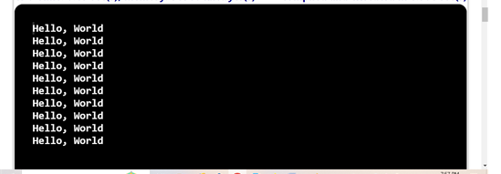

## Problem Statement

1.	Write a java program that prints the Hello, World message 10 times.

## Algorithm

	Step 1:  Start the program.
	Step 2:  Create a class named HelloWorld with a main  
            method ()
	Step 3:  Inside the main method, repeat the following for 10 times.
            print the word “Hello, World” using the output statement   
   Step 4:  Save the program as HelloWorld.java.
	Step 5:  End the program.

INPUT:

No need to give the input.

OUTPUT:

 

