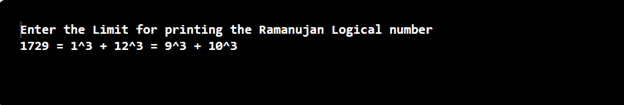
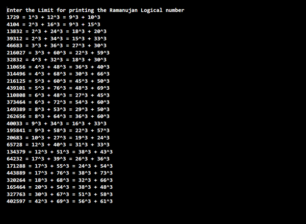

## Problem Statement

Ramanujan’s taxi. Srinivasa Ramanujan was an Indian mathematician who became famous for his intuition for numbers. When the English mathematician G. H. Hardy came to visit him one day, Hardy remarked that the number of his taxi was 1729, a rather dull number. To which Ramanujan replied, “No, Hardy! No, Hardy! It is a very interesting number. It is the smallest number expressible as the sum of two cubes in two different ways.” Verify this claim by writing a program that takes an integer command-line argument n and prints all integers less than or equal to n that can be expressed as the sum of two cubes in two different ways. In other words, find distinct positive integers a, b, c, and d such that a3 + b3 = c3 + d3. Use four nested for loops.

EXPLANATION:
It is the number expressible as the sum of two cubes in two different ways, For Example, 1729 = 13+123=93+103 (Whereas 13+123= 1729 as well 93+103 =1729) 

## Algorithm:

    Step 1:	Start the program.
	Step 2: Create a class named “Ramanujan” with a main method ()
    Step 3: Inside the Main Method (), parse the command-line arguments using the variable “n” as an integer datatype.
    Step 4: Create a “for” loop
            a.	Do inline initialization for the loop variable “a=1”
            b.	Check the “for” loop variable “a<=n”.
            c.	Increment the “for” loop variable “a” by 1
            d.	Calculate the cube of the variable “a” and store it in the variable “a3” within the “for” loop.
            e.	Check whether the variable “a3” is greater than variable “n” using the “If” Conditional Statement. If the Condition is True Quit out from the Loop using the “Break” Control Statement.
    Step 5: Create another Nested “for” loop as a second nested loop,
            a.	Do inline initialization for the loop variable “b=a”
            b.	Check the “for” loop variable “b<=n”.
            c.	Increment the “for” loop variable “b” by 1
            d.	Calculate the cube of the variable “b” and store it in the variable “b3” within the “for” loop.
            e.	Check whether the sum of the variable “a3” and “b3” is greater than variable “n” using the “If” Conditional Statement. If the Condition is True Quit out from the Loop using the “Break” Control Statement.
    Step 6: Create another Nested “for” loop as a third nested loop
            a.	Do inline initialization for the loop variable “c=a+1”
            b.	Check the “for” loop variable “c<=n”.
            c.	Increment the “for” loop variable “c” by 1
            d.	Calculate the cube of the variable “c” and store it in the variable “c3” within the “for” loop.
            e.	Check whether variable “c3” is greater than the sum of the variable “a3” and “b3” using the “If” Conditional Statement. If the Condition is True Quit out from the Loop using the “Break” Control Statement.
    Step 7: Create another Nested “for” loop as a fourth nested loop
            a.	Do inline initialization for the loop variable “d=c”
            b.	Check the “for” loop variable “d<=n”.
            c.	Increment the “for” loop variable “d” by 1
            d.	Calculate the cube of the variable “d” and store it in the variable “d3” within the “for” loop.
            e.	Check whether the sum of the variable “c3” and “d3” is greater than the sum of the variable “a3” and “b3” using the “If” Conditional Statement. If the Condition is True Quit out from the Loop using the “Break” Control Statement.
    Step 8: Use the “If” Conditional Statement to Check whether the sum of the variable “c3” and “d3” is greater than the sum of the variable “a3” and “b3” within all Nested “For” Loop.  If the Condition is true print the following.
            a.	Sum of the variables a3 and b3 along with symbol “=”
            b.	Variable “a” and “b” representing it as the cubical value along with the symbol “=”
            c.	Variable “c” and “d” representing it as the cubical value	
    Step 9: Save the program as “Ramanujan.java”
	Step 10: End the program.

## Input 1

## Output 1

## Input 2

## Output 2

