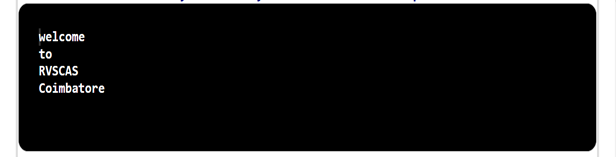

## Problem Statement

Write a code fragment that reverses the order of the values in a one dimensional string array. Do not create another array to hold the result?

## Algorithm:

    Step 1:	Start the program.
	Step 2: Create a class named   ReverseArrayInPlace with a main method ().
	Step 3: Inside the main method.
			(i) Declare and initialize a string array with the desired values.
			(ii) Obtain the length of the array and store it in the variable length.
			(iii) Use a for loop to iterate over the array from index 0 to length / 2 - 1:
			(iv) Inside the loop, perform the following steps:
				• Create a string variable named temp and assign it the value of array [length - i - 1]. This variable will temporarily hold an element while swapping.
				• Assign the value of array[i] to array [length - i - 1] to perform the swap.
				• Assign the value of temp to array[i] to complete the swap.	Increment i by 1.
			(v)  Use another for loop to iterate over the array from index 0 to length - 1:
			(vi) Continue the loop as long as i is less than the length of the array.
			(vii) Inside the loop, perform the following steps:
				• Create a string variable named element and assign it the value of array[i].
				• Print the value of element.
	Step 4: Print the value result.
	Step 5: Save the program as ReverseArrayInPlace.java
	Step 6: End the program.

## Input

String [] array = {"Coimbatore","RVSCAS","to","Welcome"};

## Output

