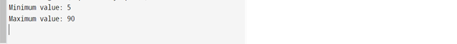

## Problem Statement

Write a program that reads in integers (as many as the user enters) from standard input and prints the maximum and minimum values.

## Algorithm:

    Step 1:	Start the program.
	Step 2: Create a class named   MaxMin with a main method ().
	Step 3: Inside the main method.
		(i) Declare and initialize two integer variables, max and min, with the first value read from the standard input using StdIn.readInt().
		(ii) Read the next integer from the standard input using StdIn.readInt() in a loop until the input is empty:
			• Initialize an integer variable value and assign it the value read from the standard input.
			• Check if value is greater than the current max value. If so, update max with the new value.
			• Check if value is less than the current min value. If so, update min with the new value.
	Step 4: Once the input is empty, there are no more integers to read. Exit the loop.
	Step 5: Print the maximum and minimum values using StdOut.println(), displaying "maximum = max" and "minimum = min".
	Step 6: Save the program as MaxMin.java
	Step 7: End the program.

## Input

## Output

