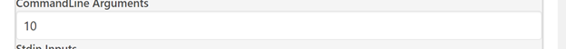
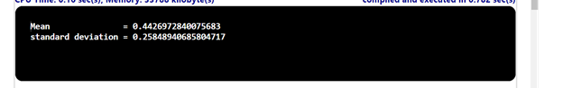

## Problem Statement

Write a program that takes an integer command-line argument n, reads n floating-point numbers from standard input, and prints their mean (average value) and sample standard deviation (square root of the sum of the squares of their differences from the average, divided by n-1).

## Algorithm:

    Step 1:	Start the program.
	Step 2: Create a class named Standard Input with a main method ().
	Step 3: Inside the main method.
			(i)  Parse the first command-line argument (args[0]) as an integer n to determine the number of values to read.		
			(ii) Create a double array a with a length of n.
			(iii)Read n values and store them in the array a.
			(iv) Initialize a double variable sum to 0.0 to store the sum of all values in the array.
			(v)  Iterate over each element in the array a:
					• Add the current element to the sum variable.
			(vi) Compute the mean by dividing the sum by n and store it in the double variable mean.
			(vii) Initialize a double variable sum2 to 0.0 to store the sum of squared differences from the mean.
			(viii)Iterate over each element in the array a:
					• Compute the squared difference between the current element and the mean.
					• Add the squared difference to the sum2 variable.
			(ix) Compute the standard deviation by dividing the square root of sum2 divided by (n - 1) and store it in the double variable stddev
			(x) Print the computed mean and standard deviation.
	Step 4: Save the program as StandardInput.java
	Step 5: End the program.

## Input

## Output

