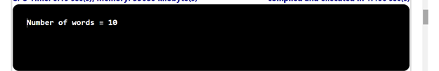

## Problem Statement

Write a program that reads in text from standard input and prints the number of words in the text.

## Algorithm:

    Step 1:	Start the program.
	Step 2: Create a class named WordCount with a main method ().
	Step 3: Inside the main method.
			(i) Initialize an integer variable count to 0 to store the count of words.
			(ii) Read input from the standard input using StdIn.readString() in a loop until the input is empty:
				• Check if the standard input is not empty using StdIn.isEmpty().
				• If it's not empty, read the next word from the standard input and store it in a string variable word.
				• Increment the count variable by 1 to count the word.
			(iii) Once the input is empty, exit the loop.
			(iv) Print the variable count
	Step 4: Save the program as WordCount.java
	Step 5: End the program.

## Input

## Output

