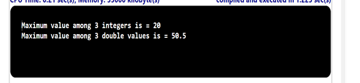

## Problem Statement

Write a static method max3() that takes three int arguments and returns the value of the largest one. Add an overloaded function that does the same thing with three double values.

## Algorithm:

    Step 1:	Start the program.
	Step 2: Create a class named MethodOverloading with a main method ().
	Step 3: Inside the main method.
			(i) Call the max3() method with three integer arguments. Assign the returned result to the Maxint variable. 
				int MaxInt = max3(10,20,5);
			(ii)Print the value of MaxInt.
			(iii)Call the max3 method with three double arguments.Assign the returned result to the MaxDouble variable.
		 		double MaxDouble = max3(10.5,20.6,50.50);
			(iv)Print the value of MaxInt
	Step 4: Declare the max3() method as static and public, which takes three integer arguments a, b, and c, and returns the maximum value among the three.
	Step 5: Inside the max3() method, initialize a variable max with the value of a.
			(i)  Compare b with max and update max if b is greater.
			(ii) Compare c with max and update max if c is greater.
			(iii)Return the value of max.
	Step 6: Declare another max3() method as static and public, which takes three double arguments a, b, and c, and returns the maximum value among the three.
	Step 7: Inside the max3() method, initialize a variable max with the value of a.
	     	Repeat the same steps 5-(i), (ii) and (iii) here.
	Step 8: Save the program as MethodOverloading.java
	Step 9: End the program.

## Input

	10 20 5
	10.5 20.6 50.50

## Output

