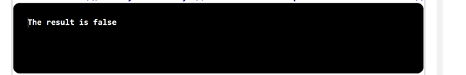
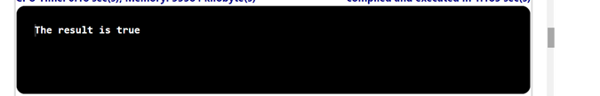

## Problem Statement

Write a static method majority () that takes three Boolean arguments and returns true if at least two of the argument values are true, and false otherwise. Do not use an if statement.

## Algorithm:

    Step 1:	Start the program.
	Step 2: Create a class named MajorityChecker with a main method ().
	Step 3: Inside the main method.
			(i)  Parse the command-line arguments a, b, and c as boolean values.
			(ii)  Call the majority method and pass a, b, and c as arguments. 
			(iii) Store the returned result in the result variable.
			(iv) Print the result.
	Step 4: Declare the majority () method as static and public, which takes three boolean arguments a, b, and c, and returns a boolean value.
	Step 5: Inside the majority method (), return the logical OR (||) of the following three 
	     conditions:
			(i) (a && b): Check if both ‘a’ and ‘b’ are true.
			(ii) (a && c): Check if both ‘a’ and ‘c’ are true.
			(iii) (b && c): Check if both ‘b’ and ‘c’ are true.
	Step 6: Save the program as MajorityChecker.java
	Step 7: End the program.

## Input 1

## Output 1

## Input 2

## Output 2

