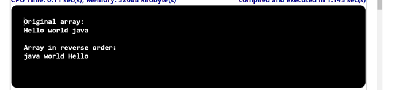

## Problem Statement

Write a static method reverse () that takes an array of strings as its argument and returns a new array with the strings in reverse order.

## Algorithm:

    Step 1:	Start the program.
	Step 2: Create a class named ReverseArray with a main method ().
	Step 3: Inside the main method.
			(i) Create a String array named "arr" and initialize it with the values.
			(ii)Call the printArray method, passing the "arr" array as an argument.
			(iii)Call the reverse method passing the "arr" array as an argument. Assign the returned result to the String array reversedArr.
    Step 4: Declare the reverse method (), which takes a String array as input and returns a String array:
    Step 5: Inside the reverse method ()
			(i) Create a new String array named "reversedArr" with the same length as the input array.
			(ii)Iterate over the input array using a for loop with the variable "i" ranging from 0 to the length of the array minus 1:
			(iii)Assign the value of the input array at the index (length - 1 - i) to the reversedArr at index i.
			(iv)Return the "reversedArr" array.
    Step 6: Declare the printArray() method, which takes a String array as input and does not return a value:
    Step 7: Inside the printArray method ()
			(i) Iterate over the input array using a for loop with the variable "i" ranging from 0 to the length of the array minus 1:
			(ii) Print the value of the input array at index i followed by a space.
	Step 8: Save the program as ReverseArray.java
	Step 9: End the program.

## Input

"Hello" "world" "java"

## Output

