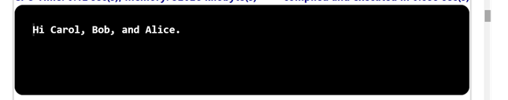

## Problem Statement

2.	Write a java program named as UseThree.java that takes three names as command-line arguments and prints a proper sentence with the names in the reverse of the order given, so that, for example, java UseThree Alice Bob Carol prints Hi Carol, Bob, and Alice.

## Algorithm

    Step 1: Start the program.
	Step 2: Create a class named UseThree with a main method ().
	Step 3: Inside the main method, do the following.
 			(i) Parse the strings “Alice”, “Bob”, “Carol” through the command-line arguments args[0], args[1], args[2].
			(ii)Print the following using the output statement
    			Hi Carol, Bob, and Alice
	Step 4: Save the program as UseThree.java.
	Step 5: End the program

INPUT
    

OUTPUT
    

 

