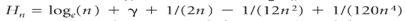
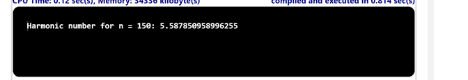

## Problem Statement

Write a program Harmonic that contains three staticmethodsharmoinc(), harmoincSmall(), and harmonicLarge() for computing the harmonic numbers. The harmonicSmall() method should just computethe sum (Hn = 1 + 1/2 + 1/3 + ... + 1/n), the harmonicLarge() method should use the approximation   (the number  = 0.577215664901532... is known as Euler’s constant), and the harmonic() method should call harmonicSmall() for n < 100 and harmonicLarge() otherwise.

## Algorithm:

    Step 1:	Start the program.
	Step 2: Create a class named Harmonic with a main method ().
	Step 3: Inside the main method.
			(i) Parse the command-line argument n as a integer value.
			(ii)Call the harmonic method, passing the value of "n", and assign the result to the variable "harmonicNumber".
			(iii)Print the result n.
    Step 4: Declare the harmonic method, which takes an integer "n" as input and returns a double
    Step 5: Inside the harmonic () method
			(i) Check if "n" is less than 100:
				• If true, call the harmonicSmall method, passing the value of "n", and return the result.
				• If false, call the harmonicLarge method, passing the value of "n", and return the result.
	Step 6: Declare the harmonicSmall method, which takes an integer "n" as input and returns adouble.
    Step 7: Inside the harmonicSmall() method 
			(i) Declare a variable named "sum" and initialize it to 0.0.
			(ii)Iterate over the numbers from 1 to "n" using a for loop with the variable "i":
			(iii)Add the reciprocal of "i" (1.0 / i) to the "sum" variable.
			(iv)Return the value of "sum".
    Step 8: Declare the harmonicLarge method, which takes an integer "n" as input and returns a double.
    Step 9: Inside the harmonicLarge() method.
			(i) Return the result of evaluating the expression Math.log(n) + 0.5772156649 (Euler's constant approximation).
    Step 10: Save the program as Harmonic.java
    Step 11: End the program.

## Input 1

## Output 1

## Input 2

## Output 2

