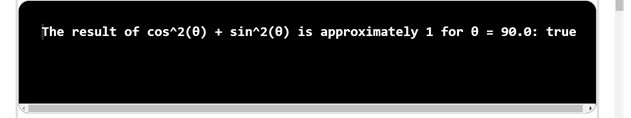

## Problem Statement

Write a java program that uses Math.sin() and Math.cos() to check that the value of cos2θ + sin2θ is approximately 1 for any θ entered as a command-line argument. 

## Algorithm

    Step 1: Start the program.
    Step 2: Create a class named TrigonometryApproximation with a main method ().
    Step 3: Inside the main method.
            (i) Parse the command-line argument θ as a double value representing the angle in radians.
            (ii)Calculate the value of cos^2(θ) using Math.cos(θ) * Math.cos(θ) and store it in a variable cosSquared.
            (iii)Calculate the value of sin^2(θ) using Math.sin(θ) * Math.sin(θ) and store it in a variable sinSquared.
    Step 4: Calculate the sum of cosSquared and sinSquared and store it in a variable sum.
    Step 5: Print the value sum.
    Step 6: Save the program as TrigonometryApproximation.java
    Step 7: End the program.

   ## Input
      
   

   ## Output
   
   