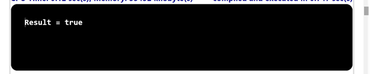
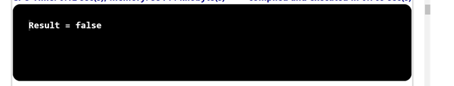

## Problem Statement

4.	Write a program that takes three double command-line arguments x,y, and z and prints true if the values are strictly ascending or descending (x < y < z or x > y > z), and false otherwise.

## Algorithm

	Step 1:  Start the program
	Step 2:  Create a class named BooleanEx with a main method ().
	Step 3:  Inside the main method.
		      (i)  Parse the command-line arguments x, y, and z as double values.
		      (ii) Evaluate the expression (x > y) && (y > z) and store the result in a boolean variable r1.
		      (iii)Evaluate the expression (x < y) && (y< z) and store the result in a boolean variable r2.
		      (iv) Calculate the logical OR (||) of r1 and r2 and store the result in a boolean variable result.
	Step 4: Print the value result.
	Step 5: Save the program as BooleanEx.java
	Step 6: End the program.

## Input1

## Output1

## Input2

## Output2

## Input3

## Output3

