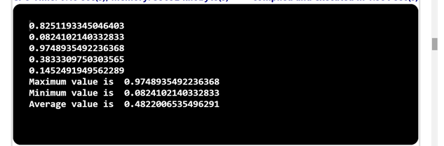

## Problem Statement

5.	Write a program that prints five uniform random numbers between 0 and 1, their average value, and their minimum and maximum values. Use Math.random(), Math.min(), and Math.max().
# Algorithm:

    Step 1: Start the program.
	Step 2: Create a class named UniformRandomNumbers with a main    method ().
	Step 3: Inside the main method
	        (i) Declare 5 variables r1, r2, r3, r4, r5.
			(ii)Declare the variables max, min, sum, avg to store the sum, minimum value, maximum value, Average and initialize them appropriately.
	Step 4: Repeat the following steps five times:
			(i) Generate a random number between 0 and 1 using Math.random().	
			(ii)Update the minimum value using Math.min() by comparing the generated random number with the current minimum value.
				min=Math.min(r1,r2);
				min=Math.min(min,r3);
			(iii)Update the maximum value using Math.max() by comparing the generated random number with the current maximum value.
				max=Math.max(r1,r2);
			   	max=Math.max(max,r3);
			(iv)Print the generated random number.
	Step 5: Calculate the sum value by adding the 5 random numbers.
	        sum =r1+r2+r3+r4+r5;
	Step 6: Calculate the average value by dividing the sum by five.
			Average =sum/5;
	Step 7: Print the 5 generated random numbers, average value, minimum value, and maximum value.
	Step 8: Save the program as UniformRandomNumbers.java
	Step 9: End the program.

## Input

    No need to give the input.

## Output

