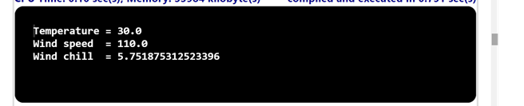

## Problem Statement

Wind chill. Given the temperature t (in degrees Fahrenheit) and the wind speed v (in miles per hour), the National Weather Service defines the effective temperature (the wind chill) as follows: w = 35.74 +0.6215 T+ (0.4275*T - 35.75) *v 0.16 
Write a program that takes two double command-line arguments temperature and velocity and prints the wind chill. Use Math.pow(a, b) to compute ab. Note: The formula is not valid if   T is larger than 50 in absolute value or if v is larger than 120 or less than 3 (you may assume that the values you get are in that range).

## Algorithm:

    Step 1:	Start the program.
	Step 2: Create a class named WindChill with a main method ().
	Step 3: Inside the main method,
			(i) Parse the command-line arguments temperature and velocity as double values representing the temperature t (in degrees Fahrenheit) and wind speed v (in miles per hour), respectively.
			(ii)Calculate the wind chill using the formula 
 			   w = 35.74 + 0.6215 * T + (0.4275 * T - 35.75) * v0.16 
             and store it in a variable w.
	Step 4: Print the wind chill value w.
	Step 5: Save the program as WindChill.java
	Step 6: End the program.

## Input

## Output

