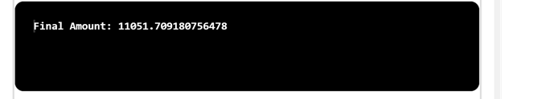

## Problem Statement

Continuously compounded interest. Write a program that calculates and prints the amount of money you would have after t years if you invested P dollars at an annual interest rate r (compounded continuously).
The desired value is given by the formula Pert

# Algorithm:

    Step 1:	Start the program.
	Step 2: Create a class named ContinuousCompoundInterest with a main method().
	Step 3: Inside the main method,
			(i) Parse the command-line arguments p, r, and t as double values representing the principal amount,annual interest rate, and number of years, respectively.
			(ii) Calculate the value of e raised to the power of r multiplied by t using the Math.exp() method and store it in a variable expResult.
			(iii) Calculate the final amount using the formula P * expResult and store it in a variable FinalAmount.
	Step 4: Print the value Final amount.
	Step 5: Save the program as ContinuousCompoundInterest.java
	Step 6: End the program.

## Input

## Output

