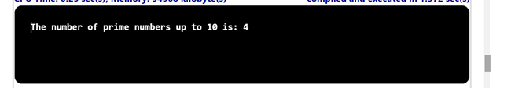

## Problem Statement

Write a program PrimeCounter that takes an integer command-line argument n and finds 
the number of primes less than or equal to n.

## Algorithm:

    Step 1:	Start the program.
	STEP 1: Start the Program 
    STEP 2: Create a class named PrimeCounter with a main method ()
    STEP 3: Inside the Main Method (), 
            (i) Parse the command-line arguments n as integer value.
            (ii) Declare and initialize the primecount variable to 0;
    STEP 4: Create a for loop to check the given number is prime or not.
            (i) Initialize the variable “count=0” within “for loop”.
    STEP 5: Create another Nested “for” loop as a second nested loop,
            (i)Check whether the variable “j” is equally divisible by variable “i” using “if” Statement.
            (ii) Increment the variable “count” by 1.
    STEP 6: Check whether the variable “count=0” using the Comparative operator and increment the primecount variable.
    STEP 7: print the result
    STEP 8: Save the program as PrimeCounter .java
    STEP 9: End the Program

## Input

## Output

